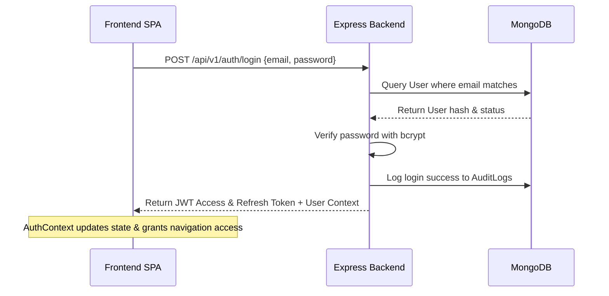
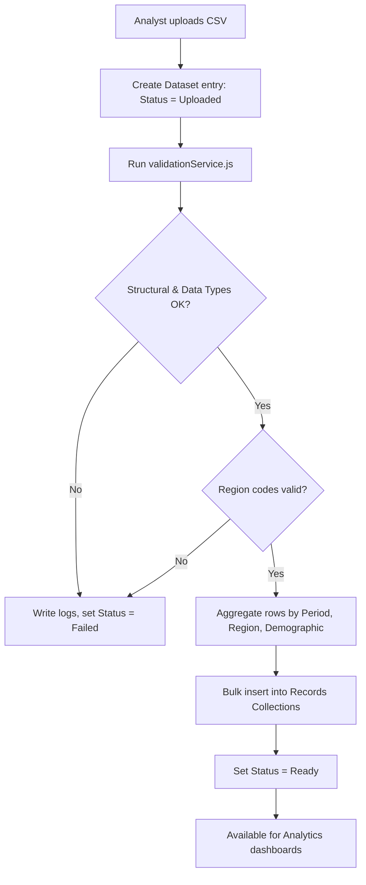
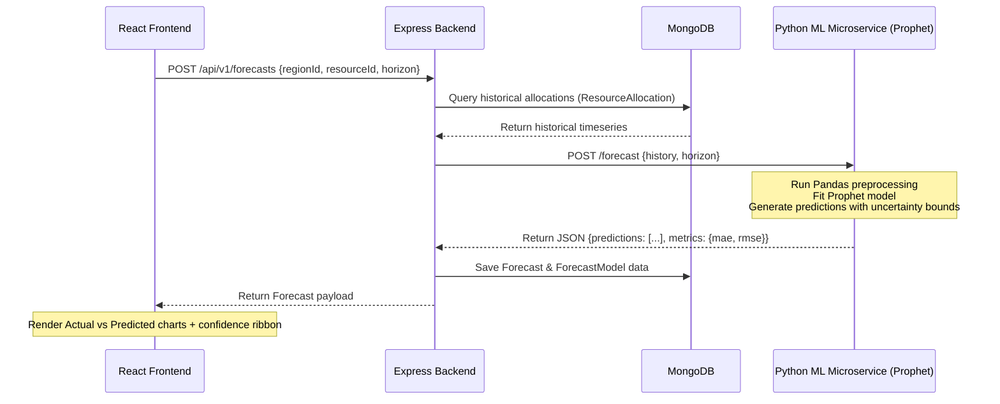

# ASTRA — Project Directory Structure & Flow

This document details the file directory hierarchy, structural layout, and execution flows of the Aadhaar Statistical Trends & Resource Analytics (ASTRA) application.

---

## 1. Project Directory Structure

```
c:\Users\shail\OneDrive\Desktop\A.S.T.R.A/
├── index.html                   # High-fidelity standalone interactive prototype (Instant Browser Preview)
├── PROJECT_STRUCTURE_AND_FLOW.md# System architecture, file layout, and data-flow map (this file)
├── README.md                    # Setup, configuration, and execution instructions
├── datasets/                    # Anonymized synthetic datasets for system ingestion testing
│   ├── sample_demographics.csv  # Demographic aggregated raw data (Age, Gender, Region, Period)
│   ├── sample_biometrics.csv    # Biometric updates raw data (Type, Age, Region, Period)
│   └── sample_resources.csv     # Resource allocations raw data (Allocated/Utilized amount, Region, Period)
├── backend/                     # Node.js + Express.js API Gateway & REST Server
│   ├── package.json             # Backend dependencies and startup scripts
│   ├── server.js                # Core entry point (app initialization, middlewares, DB connection)
│   ├── config/
│   │   └── db.js                # Mongoose / MongoDB Atlas connection configuration
│   ├── middleware/
│   │   └── auth.js              # Token validation and Role-Based Access Control (RBAC) middleware
│   ├── models/
│   │   ├── User.js              # Auth schema (hashed passwords, locked states, departments)
│   │   ├── Role.js              # Permission scopes per role
│   │   ├── Dataset.js           # Lifecycle tracker (Uploaded, Validating, Ready, Failed, quality stats)
│   │   ├── DemographicRecord.js # Aggregated demographic data (No PII)
│   │   ├── BiometricRecord.js   # Aggregated biometric counts (Enrollments/Updates, No scans/templates)
│   │   ├── Resource.js          # Catalog of resources (kits, personnel, physical centers)
│   │   ├── ResourceAllocation.js# Historical allocations per region and month
│   │   ├── Forecast.js          # Persisted forecast runs (actual vs forecasted points, bounds)
│   │   └── AuditLog.js          # Immutable security logs (user action, timestamp, metadata, IP)
│   ├── routes/
│   │   ├── auth.js              # Login, logout, refresh-token, and session validation
│   │   ├── users.js             # User provisioning and deactivation
│   │   ├── datasets.js          # File uploading, processing, and state polling
│   │   ├── analytics.js         # Demographic, biometric, and regional aggregates
│   │   ├── forecasts.js         # ML forecast generation triggers
│   │   └── audit.js             # Audit trail inspection for administrators
│   └── services/
│       ├── validationService.js # Ingest verification engine (structural, range, and business rules)
│       └── mlClient.js          # Internal HTTP client interface for Python service communication
├── frontend/                    # Vite + React.js SPA Frontend
│   ├── package.json             # Frontend packages (React, React Router, Chart.js, Leaflet)
│   ├── vite.config.js           # Vite development and build settings
│   ├── index.html               # Frontend HTML root wrapper
│   ├── src/
│   │   ├── main.jsx             # React DOM mounting entry point
│   │   ├── App.jsx              # Main routing and dashboard structure
│   │   ├── index.css            # Vanilla CSS Design System (variables, typography, layouts)
│   │   ├── context/
│   │   │   └── AuthContext.jsx  # Security context handling tokens, roles, and profiles
│   │   ├── components/
│   │   │   ├── Sidebar.jsx      # Dynamic navigation tailored to role access
│   │   │   ├── Navbar.jsx       # Header containing user context and logout triggers
│   │   │   ├── Card.jsx         # Styled containers for KPIs and visual layout modules
│   │   │   └── RegionFilter.jsx # Synchronized geographic filter toolbar
│   │   └── pages/
│   │       ├── Login.jsx        # Login panel with warning alerts and loading indicator
│   │       ├── Dashboard.jsx    # Unified landing page presenting cross-module highlights
│   │       ├── Datasets.jsx     # Upload drag-and-drop panel and historical log list
│   │       ├── Analytics.jsx    # Split-pane charts showing Demographic & Biometric trends
│   │       ├── Forecasting.jsx  # Resource forecasting timeline and allocation metrics
│   │       ├── Users.jsx        # Administrative user creation and edit tables
│   │       └── AuditLogs.jsx    # Admin audit trail search panel
└── ml-service/                  # Python Time-Series ML Forecasting Service
    ├── requirements.txt         # Python libraries (FastAPI, Uvicorn, Prophet, Pandas)
    ├── main.py                  # API endpoints exposing model invocations
    └── forecaster.py            # Facebook Prophet wrappers for fitting models and outputting confidence bounds
```

---

## 2. Core Application Flows

### Flow A: User Authentication & Role-Based Authorization
1. **User Request**: The user logs in at the frontend (`Login.jsx`) by submitting email and password.
2. **Credential Checking**: The backend route `/auth/login` checks the user profile. The password is verified against the database `passwordHash` using **bcrypt**.
3. **Token Generation**: If valid, the server logs the action to `AuditLog` and returns:
   - A short-lived **JWT Access Token** (~15 minutes) containing the user’s ID, name, role, and permission array.
   - A long-lived **Refresh Token** (~7 days) stored securely to support silent token renewal.
4. **Session Activation**: The frontend's `AuthContext` receives the tokens, stores the Access Token in memory, and decodes the user's role.
5. **Navigation Shield**: React Router blocks unauthorized routes. For example, if a *Data Analyst* attempts to navigate to the user management console, they are redirected to the Dashboard.
6. **API Shield**: If the user makes an API call, `auth.js` middleware validates the bearer token and checks that the permissions array contains the scope required for that endpoint. If missing, it returns `403 Forbidden` and logs the failure to the audit log.



---

### Flow B: Dataset Ingestion, Validation & Aggregation
1. **Upload Trigger**: A *Data Analyst* drags and drops a CSV dataset (`Datasets.jsx`) and chooses the data category (Demographic, Biometric, or Resource).
2. **Chunked Stream**: The file is sent via `/datasets/upload` to the backend. The backend stores metadata inside the `Dataset` collection with status set to `Uploaded`.
3. **Background Validation Engine**: The server fires an asynchronous job to process the dataset:
   - **Structural Check**: Checks if the file contains the exact column layout specified by the category schema.
   - **Data Validation**: Validates datatypes, formats (e.g. ISO dates), ranges (e.g. count >= 0), and ensures region names map to valid codes in the `Region` reference collection.
   - **Duplicate Checking**: Scans natural compound keys (e.g. region + period + category) to find duplicate records.
4. **Quarantining**: Any invalid rows are appended to a validation summary error log.
5. **Aggregation and Write**: 
   - If the file is invalid, status updates to `Failed` and the errors are written to the database.
   - If valid, the row records are aggregated into demographic/biometric/resource collections (`DemographicRecord`, `BiometricRecord`, `ResourceAllocation`) under a single `datasetId` for fast queries. The status updates to `Ready`.
6. **UI Reactivity**: The analyst's screen polls `/datasets/:id/status` and updates the table row indicator to `Ready` or `Failed` in real-time.



---

### Flow C: Analytics Dashboard Retrieval
1. **Filters Applied**: An authorized user loads the dashboard and configures filters (State = "Maharashtra", Age Band = "18-25", Date Range).
2. **Aggregating Queries**: The frontend queries the analytics routes:
   - `/analytics/demographics?state=MH&ageBand=18-25`
   - `/analytics/biometrics?state=MH`
3. **Database Execution**: The backend uses MongoDB aggregation pipelines to filter by state and age band, group by month, and sum records:
   - Leverages compound indexes (`regionId` + `period`) for sub-second retrieval.
4. **Data Wrapping**: Aggregated values are sent as structured arrays:
   ```json
   [
     { "period": "2026-01", "maleCount": 24000, "femaleCount": 26500 },
     { "period": "2026-02", "maleCount": 25500, "femaleCount": 28000 }
   ]
   ```
5. **Visual Rendering**: The frontend parses the arrays and plots responsive line, bar, or pie charts.

---

### Flow D: Resource Demand Forecasting (Node ↔ Python microservice)
1. **Trigger Forecast**: A *Resource Planning Officer* chooses a resource type (e.g. "Enrollment Kits"), a target region (e.g. "Mumbai District"), and sets a horizon of 6 months.
2. **Backend Retrieval**: The backend `/forecasts` handler is invoked. It queries `ResourceAllocation` records for historical inputs in that region.
3. **Pre-check**: If historical data is fewer than the minimum points, it returns `422 Insufficient historical data` and logs the warning.
4. **ML Dispatch**: If data is sufficient, the backend `mlClient.js` formats the time-series array into JSON features and does an internal HTTP POST request to the Python microservice `/forecast`.
5. **Prophet Execution**: The Python FastAPI service parses the payload into a Pandas DataFrame, structures the columns for Prophet (`ds` for time, `y` for allocations), initializes a `Prophet` model with yearly/monthly seasonalities, fits the model, and predicts the 6-month horizon.
6. **Response Payload**: The Python service extracts the forecast dates, predicted averages, lower bounds, and upper bounds, then calculates MAE, RMSE, and MAPE performance scores. It returns this structure to the Node backend.
7. **Database Storage**: The Node backend stores the results under the `Forecast` and `ForecastModel` collections and returns the document to the frontend.
8. **Visual Render**: The forecasting dashboard shows a split line chart: historical allocations as a solid line, future predictions as a dashed line, and the confidence bounds rendered as a semi-transparent colored ribbon.


